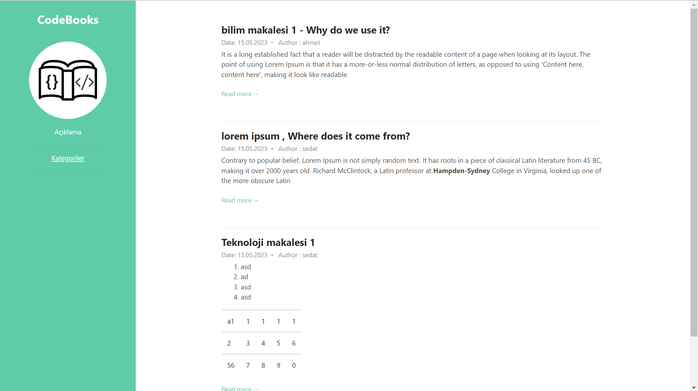
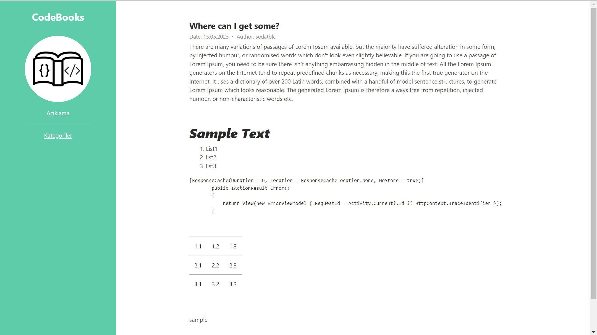
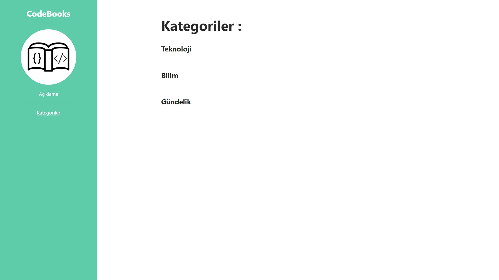
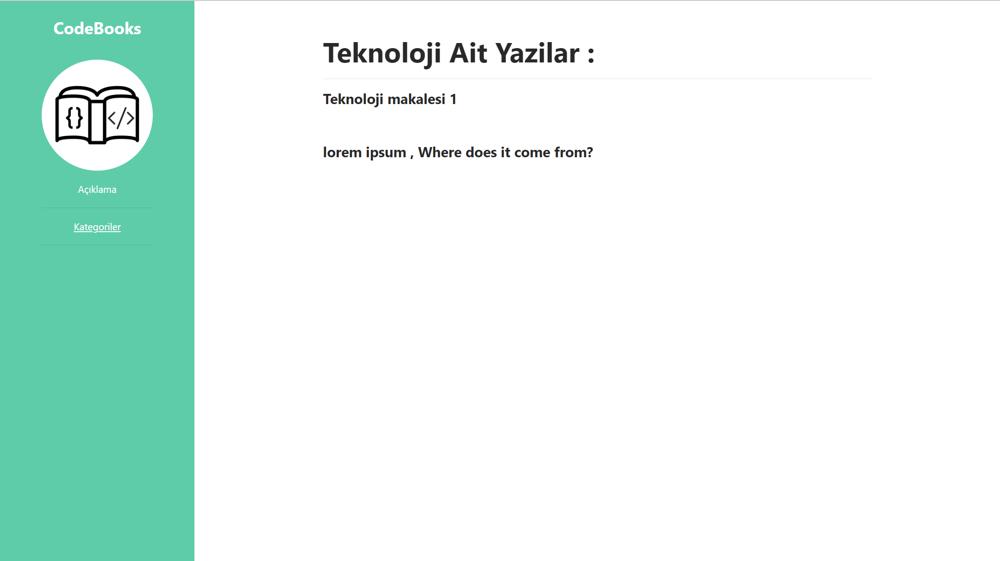
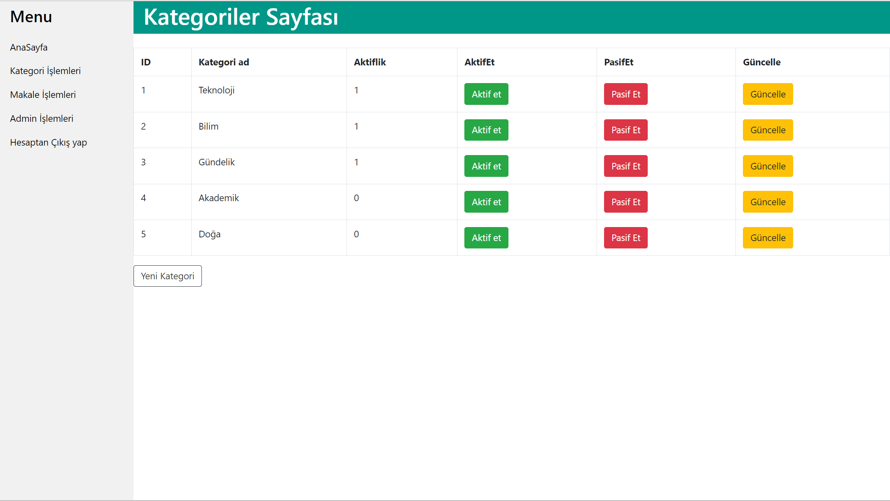
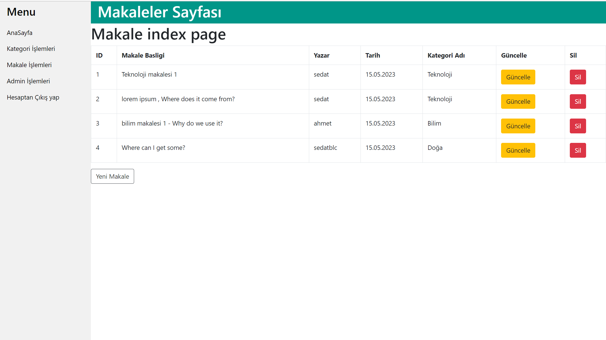
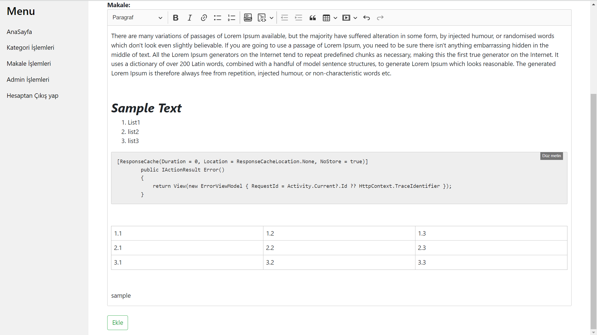

# ASP NET CORE 5.0 MVC Blog Website

### Description

This project was hastily done by me in a short period . 
`CRUD operations` , `EF` , `Authentication` , `CKeditor` are used . Ready template modified for frontend

## ScreenShots (Public area)

 
     <h5>Blog Index   </h5>
    

 
     <h5>Blog Detail   </h5>
    

 
     <h5>Active Category List  </h5>
    

 
     <h5> Category Detail  </h5>
    

 
     <h5>Login Page  </h5>
    

## ScreenShots (Admin area)

 
     <h5>Category Page  </h5>
    

 
     <h5>Blog Page  </h5>
    

 
     <h5>Add Blog Page  </h5>
    

### Usage

>You need as.net core 5.0 version in your computer 
>You need install this package : core , core tools , ef core , core mssql provider
> you must create db from migration

