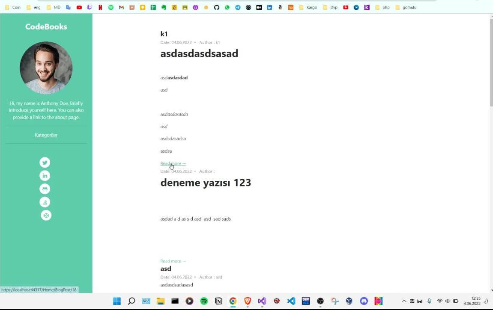
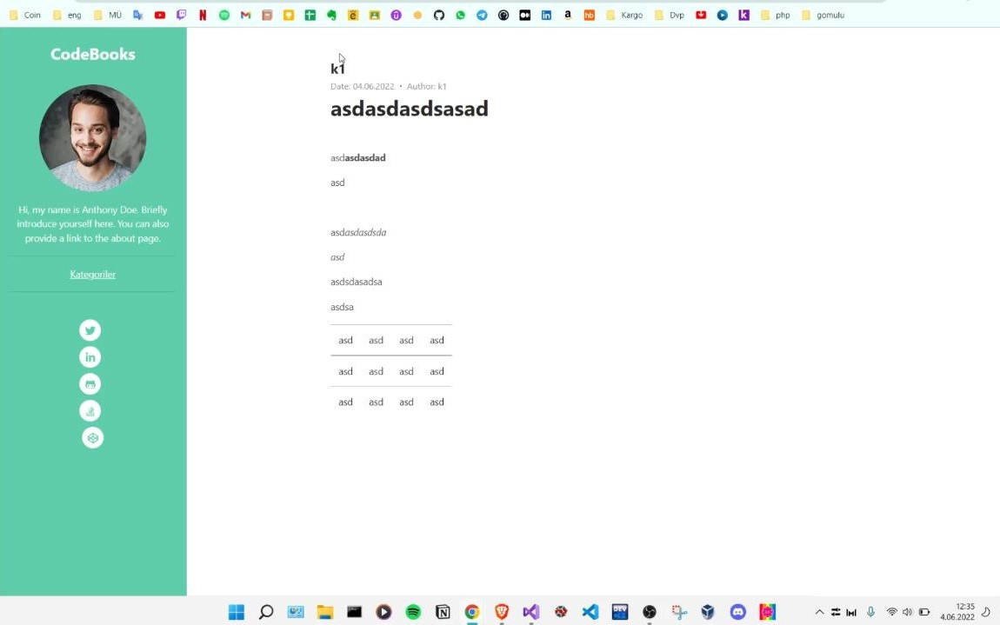
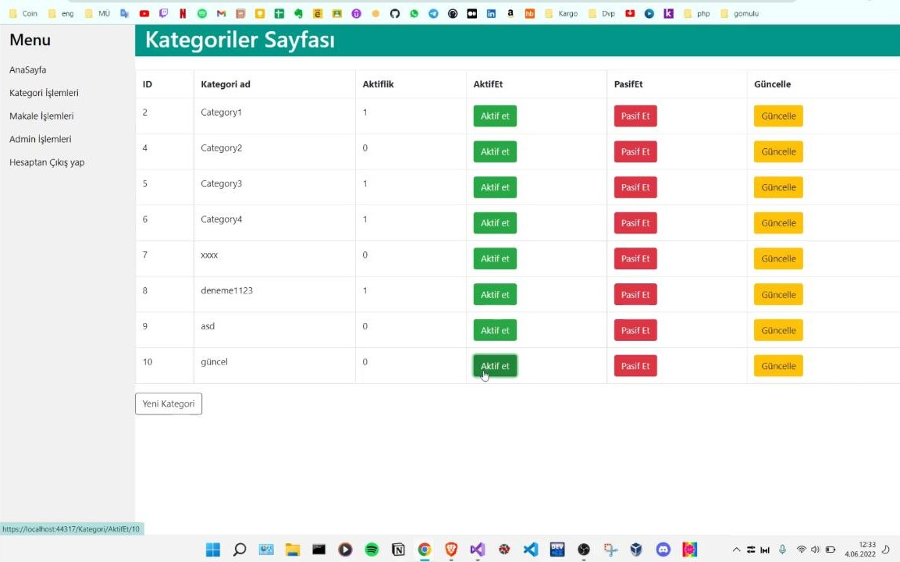
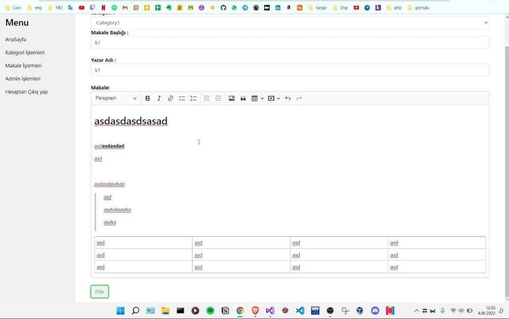

# ASP NET CORE 5.0 MVC Blog Website

### Description

This project was hastily done by me in a short period . 
`CRUD operations` , `EF` , `Authentication` , `CKeditor` are used . Ready template modified for frontend

## ScreenShots

 
     <h5>Blog index   </h5>
    

 
     <h5>Blog detail   </h5>
    

 
     <h5>Admin  list  </h5>
    

 
     <h5>Blog editor  </h5>
    

### Usage

>You need as.net core 5.0 version in your computer 
>You need install this package : core , core tools , ef core , core mssql provider
> you must create db from migration

